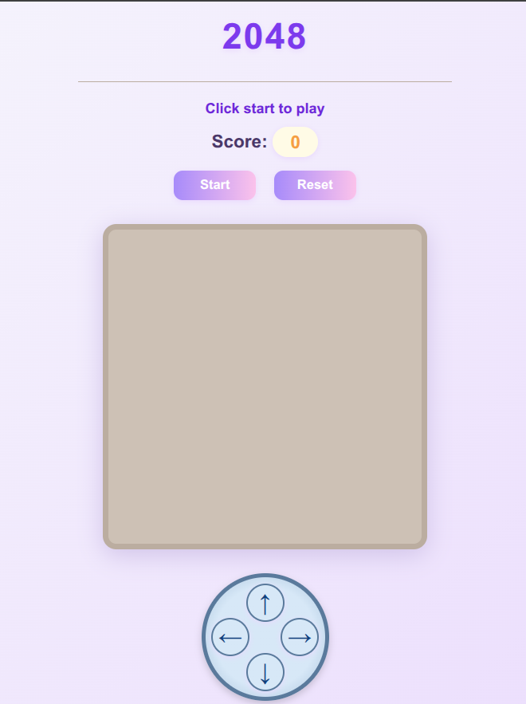

# 🎮 2048 Game

Welcome to the **2048 Game** – a modern, responsive, and addictive puzzle game built with HTML, CSS, and JavaScript!

---

## 🧩 What is 2048?

2048 is a single-player sliding block puzzle game. The objective is simple: **combine tiles with the same number to reach the 2048 tile!**  
Swipe or use the on-screen arrow buttons to move all tiles. When two tiles with the same number touch, they merge into one. The game ends when no moves are left or you reach the 2048 tile.

---

## ✨ Features

- **Beautiful, modern design**
- **Responsive layout** – play on any device (desktop, tablet, mobile)
- **Touch controls** – swipe or tap arrow buttons to play on touch screens
- **On-screen arrow controls** – play without a keyboard
- **Smooth animations** and sound effects
- **Score tracking**
- **Restart and reset buttons**
- **Win detection** – special sound and alert when you reach the 2048 tile
- **Game Over detection** – sound and alert when no moves are left

---

## 🚀 How to Play

1. **Start the game** by clicking the **Start** button.
2. **Move tiles** using the on-screen arrow buttons or swipe gestures (mobile/tablet).
3. **Combine tiles** with the same number to create larger numbers.
4. **Reach 2048** to win!
   - When you reach the 2048 tile, you'll hear a victory sound and see a congratulatory message.
5. **Game Over** when no moves are possible.
   - You'll hear a game over sound and see your score.

---

## 📱 Controls

- **Desktop:** Use the on-screen arrow buttons (keyboard optional)
- **Mobile/Tablet:** Swipe in any direction or tap the arrow buttons

---

## 🖼️ Screenshots

---

## 🛠️ Tech Stack

- **HTML5**
- **CSS3**
- **JavaScript**

---

## 💡 Credits

- Inspired by [Gabriele Cirulli's 2048](https://github.com/gabrielecirulli/2048)
- Sounds and icons from open-source resources

---

## 📄 License

This project is open source and free to use.

---

Enjoy playing and challenge yourself to reach the 2048 tile!
